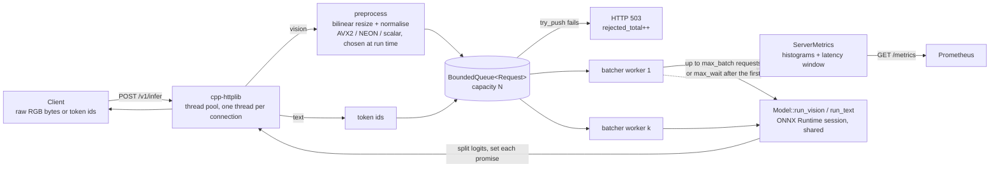

# Architecture and trade-offs

## Request path

1. The HTTP thread parses the request. For an image it runs the preprocessing kernel right there,
   so resizing request *i+1* overlaps with inference of request *i*.
2. It calls `Batcher::submit`, which does a non-blocking `try_push` onto a bounded queue and returns a
   `std::future<Result>`. A full queue returns nothing and the handler answers 503 immediately.
3. A batcher worker blocks on the queue for the first request, then keeps collecting until it has
   `max_batch` requests or `max_wait` has passed *since the first one was enqueued*. It drains
   whatever is already queued in one lock acquisition (`drain_into`) before it waits again.
4. It concatenates the batch into one tensor (images are fixed size; text is right-padded with a zero
   attention mask), makes **one** `Session::Run` call, checks the output size, splits the logits and
   fulfils each request's promise. Exceptions go to every future of that batch.

## Components

| File | What it is | Why it is built this way |
|---|---|---|
| `include/edgeinfer/bounded_queue.hpp` | MPMC queue: `std::deque`, one mutex, two condition variables | Bounded, so overload becomes a fast 503 rather than unbounded memory and latency. Two CVs so a pop wakes a producer, not another consumer. `pop_for` gives the batcher its deadline wait. |
| `include/edgeinfer/mpmc_ring.hpp` | Lock-free MPMC ring (Vyukov), power-of-two capacity, per-slot sequence numbers | The comparison point. Producers and consumers contend only on their own index (cache-line aligned to avoid false sharing); the slot's sequence number carries the acquire/release synchronisation and encodes the lap, so there is no ABA problem. It never blocks, so callers spin or yield. |
| `include/edgeinfer/thread_pool.hpp` | Fixed pool over `BoundedQueue<std::function<void()>>`, `submit` returns `std::future` | `packaged_task` is move-only and `std::function` needs copyable, hence the `shared_ptr` wrapper. |
| `src/batcher.cpp` | Dynamic micro-batching (see above) | The model-specific part is a `RunBatch` callable, so the batcher is tested with fake models. It validates the output size: AddressSanitizer caught a heap overflow when a fake model returned too few values. |
| `src/model.cpp` | RAII wrapper over `Ort::Session` | Reads the input signature to decide vision vs text. Sessions are shared across threads (`Run` is thread-safe). Spinning is off by default (see below). Keeps `Ort::TypeInfo` alive while reading shapes: the shape object is a non-owning view, and reading it from a temporary was a real dangling-reference bug found during development. |
| `src/preprocess_*.cpp` | Resize + normalise, three implementations, one signature | The scalar path is the definition of correct; SIMD paths are tested against it to 1e-5. Run-time dispatch (`__builtin_cpu_supports`) means one x86 binary runs on CPUs without AVX2. |
| `src/metrics.cpp` | Prometheus text format without a client library | Atomic counters and fixed-bucket histograms (one relaxed increment per sample), plus a mutex-guarded window of the last 4,096 latencies for exact p50/p95/p99 gauges. |
| `src/loadgen.cpp` | Open-loop C++ load generator | Requests are scheduled on a Poisson clock and latency is measured from the *scheduled* time, so a slow server cannot slow the client down and hide its own queueing (coordinated omission). |

## The AVX2 kernel

Bilinear resize needs four source pixels per output pixel, and RGB is interleaved, so the core of
the kernel is a gather. The first version loaded the 12 bytes per output pixel one at a time, and that
scalar gather loop dominated its run time. The final version issues one `vpgatherdd` per bilinear corner for
8 output pixels: each lane loads the 4 bytes starting at its source pixel (R, G, B and one byte of
the next pixel), and a per-lane variable shift (`vpsrlvd`) plus a mask extracts each channel. That is
4 gathers per 8 output pixels instead of 96 scalar byte loads. A load at the last pixel of a row would
read one byte past the row, so for those columns the load starts one byte earlier and the shift skips
that byte; the offsets and shifts are computed once per image. All arithmetic (two horizontal lerps,
one vertical lerp, scale and bias folded into one FMA) runs 8 wide.

**NEON has no gather instruction**, so the NEON path still collects the corner bytes with scalar loads
and only widens and computes in vector registers. On a GitHub arm64 runner it is barely faster than
scalar (see the README). A NEON-specific design would de-interleave each source row once with `vld3`
and do separable horizontal and vertical passes; that is listed as future work rather than claimed.

## Threads: why the server runs many single-threaded workers

Each inference can itself use `intra_op_threads` ONNX Runtime threads. The pool of batcher workers
multiplies that. On the 4 pinned cores, ResNet-50 int8 did best with 4 workers x 1 intra-op thread and
worst when workers x threads far exceeded the cores (`results/threads.json`). Wide sessions waste
time synchronising inside small operators; oversubscribed ones lose to the scheduler. ORT's
`allow_spinning` keeps idle threads busy-waiting between operators: with exactly one caller it can
help (MobileNetV3 with 4 threads), but with oversubscription it burns the CPU time the other threads
need and throughput collapses. It is off by default, the same lesson as the CFS-throttling fix in my
Python gateway.

## Trade-offs I would revisit

- **Queue bound vs latency target.** The queue holds 256 requests, which is more than the load
  generator ever has in flight, so overload shows up as seconds of queueing rather than 503s. The
  bound should be derived from the latency SLO (queue length x per-request service time), not memory.
- **Batching is not free on CPU.** For a CNN on 4 cores a batch of 16 costs about 16 single images, so
  batching did not raise throughput; for DistilBERT under overload it did. A production batcher would
  pick `max_batch` per model from measurements like these.
- **Text padding.** Batches are padded to the longest sequence; length bucketing would waste less work.
- **Preprocessing placement.** It runs on HTTP threads, which overlaps it with inference but takes
  CPU from the same 4 cores. Pinning HTTP and inference threads to separate cores would make that
  explicit.
